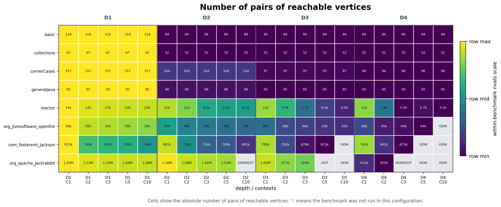
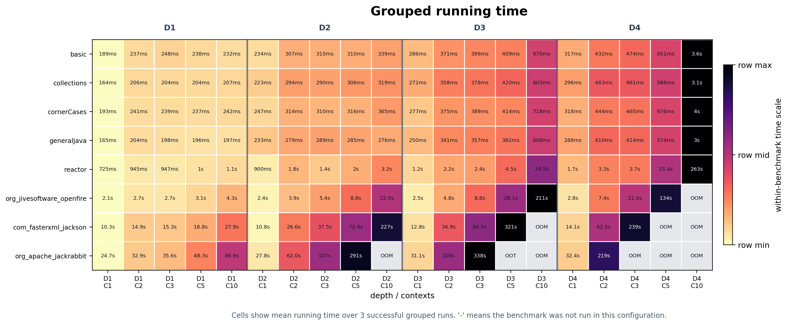
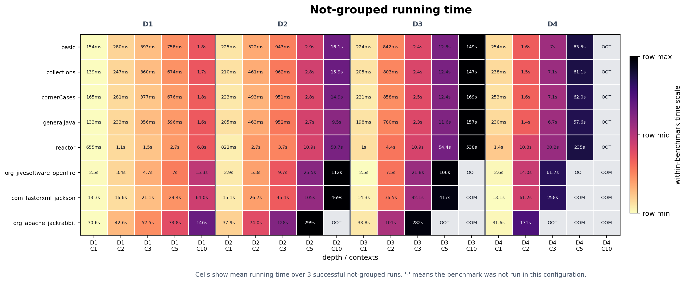
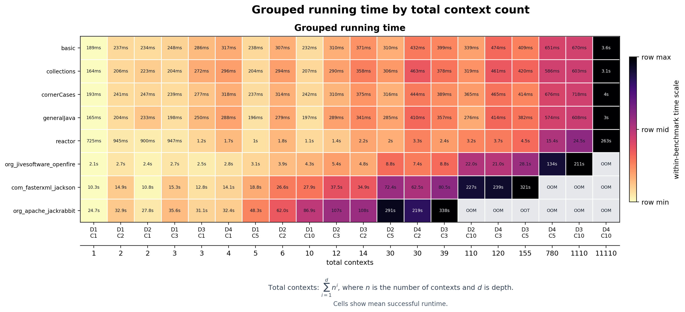
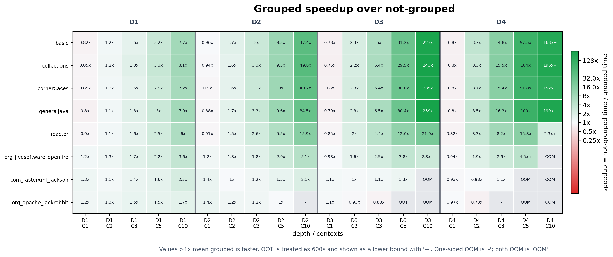
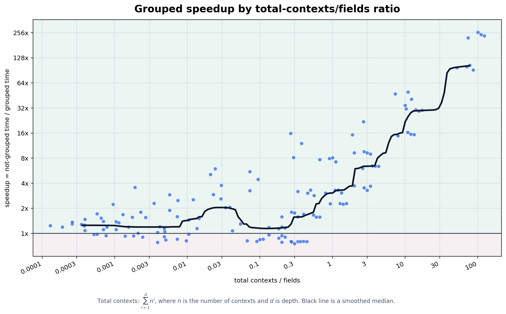
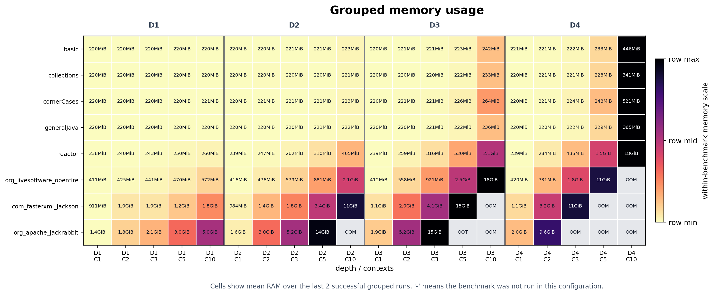
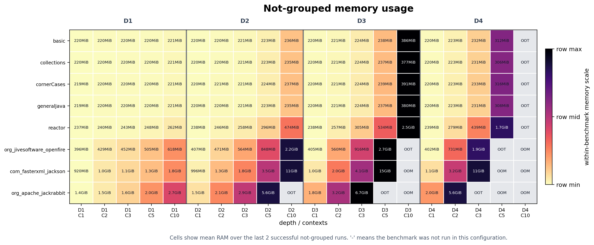
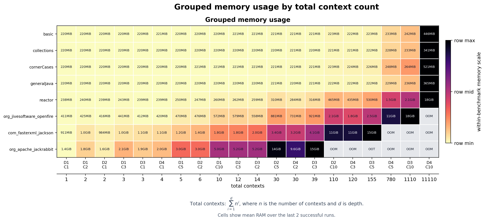
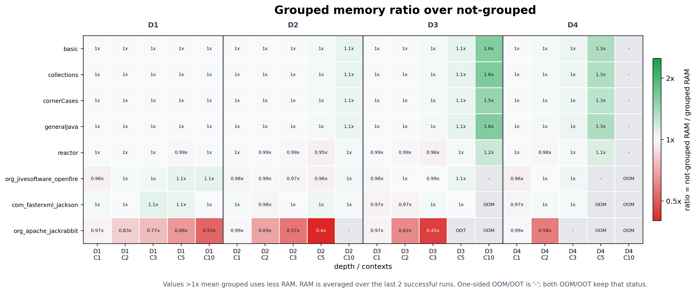

# Benchmark Analysis

## Environment

- CPU: AMD Ryzen 5 5600
- RAM: 32GB DDR4
- OS: Fedora 42
- Python: 3.11.15
- GraphBLAS: suitesparse-graphblas 9.4.5.0

## Graphs

| Graph | Vertices | Edges | Java points-to edges | Context edges | Max contexts | Fields |
| --- | ---: | ---: | ---: | ---: | ---: | ---: |
| `basic` | 230 | 476 | 270 | 170 | 27 | 15 |
| `collections` | 165 | 312 | 155 | 138 | 21 | 10 |
| `cornerCases` | 245 | 530 | 258 | 242 | 32 | 9 |
| `generalJava` | 155 | 326 | 181 | 122 | 21 | 11 |
| `reactor` | 26,997 | 84,196 | 19,037 | 61,948 | 1,580 | 414 |
| `com_fasterxml_jackson` | 243,764 | 1,070,734 | 260,967 | 758,200 | 8,150 | 2,870 |
| `org_jivesoftware_openfire` | 298,553 | 1,006,576 | 270,930 | 687,810 | 14,185 | 5,270 |
| `org_apache_jackrabbit` | 362,179 | 1,740,660 | 374,577 | 1,282,826 | 15,560 | 7,714 |

## Benchmark Methodology

The experiments compare two variants of the context-free constrained reachability algorithm:

- **Grouped**: contexts are processed in grouped form.
- **Ungrouped**: contexts are processed separately.

The analysis used all combinations of depth values from 1 to 4 (`D1`-`D4`) and context
counts 1, 2, 3, 5, and 10 (`C1`, `C2`, ...).

Each configuration was launched three times. Running time is reported as the arithmetic mean over three successful runs. Memory consumption is reported as the arithmetic mean over the last two successful runs, which reduces the effect of initialization.

The output size is reported as the number of reachable pairs.

The following failure markers are used in the tables:

- `OOT` means out of time. The timeout threshold is 600 seconds.
- `OOM` means out of memory. In this experiment, a run was treated as OOM when it started using swap.
- `-` means that the value cannot be compared, usually because only one of the two variants failed.

## 1. Reachable Pairs

This metric is the *same* for the grouped and ungrouped variants.



Some cells are marked as `OOM`, `OOT`, or `OOM/OOT`. In these configurations the result could not be fully computed under the experimental limits.

## 2. Running Time

The running-time results are shown separately for the grouped and ungrouped variants.
Each cell contains the mean running time over three successful runs.





Some configurations cannot be completed within the experimental limits and are marked as `OOM` or `OOT`.

The same grouped running-time results can also be shown by the total number of contexts induced by a configuration:

```text
total contexts = C^1 + C^2 + ... + C^D
```

where `C` is the number of contexts and `D` is the depth. The figure below
shows the grouped running-time results ordered by this total number of contexts.



After the absolute running times, we compare the two variants using speedup:

```text
speedup = ungrouped running time / grouped running time
```

Values greater than `1x` mean that grouping is faster, while values below `1x`
mean that grouping introduces overhead.



Cells marked with `+` are lower bounds. They correspond to configurations where
the ungrouped variant timed out, while the grouped variant finished
successfully.

The strongest improvements are observed on the small benchmarks. The maximum
exact speedups are `223x` for `basic`, `243x` for `collections`, `235x` for
`cornerCases`, and `259x` for `generalJava`. The `reactor` benchmark also shows
a substantial improvement, up to `21.9x`.

On the largest real-world graphs, the improvement is more moderate.
`org_jivesoftware_openfire` reaches up to `5.1x`, while
`com_fasterxml_jackson` and `org_apache_jackrabbit` are closer to `1x` in most
successful configurations.

Another likely factor is the relation between the number of contexts and the
number of fields. Grouping mainly reduces repeated work over contexts, but when
field processing contributes a large part of the total running time, the
relative benefit of grouping becomes smaller. Therefore, the observed speedup
appears to depend not only on the absolute number of contexts, but also on the
context-to-field ratio of a benchmark.

This relation is shown more directly in the following plot. The x-axis is the
ratio between the total number of induced contexts and the number of fields:

```text
context-field ratio = total contexts / fields
```



As the context-field ratio grows, the smoothed median speedup also tends to grow.

## 3. Memory Usage

Memory usage is shown separately for the grouped and ungrouped variants. Each
cell contains the mean RAM usage over the last two successful runs.





As with running time, some configurations cannot be completed under the
experimental limits and are marked as `OOM` or `OOT`.

The grouped memory results can also be shown by the total number of contexts:

```text
total contexts = C^1 + C^2 + ... + C^D
```



After the absolute memory values, we compare the two variants using the memory
ratio:

```text
memory ratio = ungrouped RAM / grouped RAM
```

Values greater than `1x` mean that the grouped variant uses less memory. Values
below `1x` mean that the grouped variant uses more memory.



On the small benchmarks, grouped evaluation can reduce memory usage in the
hardest configurations, with ratios up to `1.6x`. On `reactor`,
`org_jivesoftware_openfire`, and `com_fasterxml_jackson`, the memory ratio is
usually close to `1x`, meaning that grouping mainly improves running time rather
than memory consumption.

The main exception is `org_apache_jackrabbit`. On this benchmark, the grouped
variant often uses more memory, with the ratio dropping as low as `0.4x`. This
suggests that grouping may introduce additional intermediate state on large
graphs where field-related processing and graph size dominate the memory
footprint.

## Main Findings

- Grouping mostly improves running time, especially when the context-related part of the computation dominates.
- The strongest speedups appear on small benchmarks with high context-field ratio.
- On large real-world graphs, speedup is more moderate because field processing and graph size contribute more to the total cost.
- Memory usage is mostly similar between the two variants, with no systematic improvement comparable to running time.